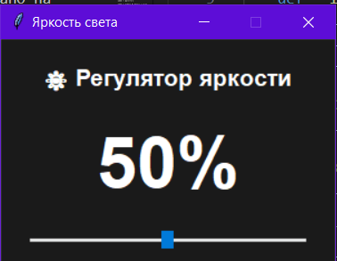

Описание

Простое приложение с графическим интерфейсом для регулировки яркости света. Реализовано на Python с использованием библиотеки Tkinter.

Функциональность
Графический слайдер для регулировки яркости от 0% до 100%

Отображение текущего значения яркости в процентах

Кнопка для мгновенного выключения света (установка на 0%)

Окно всегда поверх других окон

Темная тема интерфейса

Фиксированный размер окна

Установка и запуск
bash
# Клонирование репозитория
git clone <repository-url>

# Запуск приложения
python light_control.py
Зависимости
Python 3.x

Tkinter (стандартная библиотека Python)

Структура кода
Основные компоненты
Класс SimpleLightControl - основной класс приложения

Метод init - инициализация главного окна

Метод create_widgets - создание элементов интерфейса

Метод update_brightness - обработка изменения яркости

Метод turn_off - выключение света

Элементы интерфейса
Label с заголовком

Label с текущим процентом яркости

Scale (слайдер) для регулировки

Button для выключения

Настройки окна
Размер: 300x200 пикселей

Запрет изменения размера

Окно поверх других окон

Темный фон (#1a1a1a)

Логирование
Все изменения яркости выводятся в консоль:

При перемещении слайдера: "Установлена яркость: X%"

При нажатии кнопки выключения: "Свет выключен"

Возможные улучшения
Интеграция с реальными системами освещения

Добавление горячих клавиш

Сохранение последнего значения

Поддержка нескольких устройств

Добавление анимаций перехода

Совместимость
Windows

Linux

macOS
